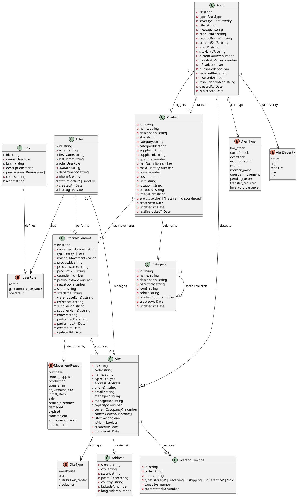
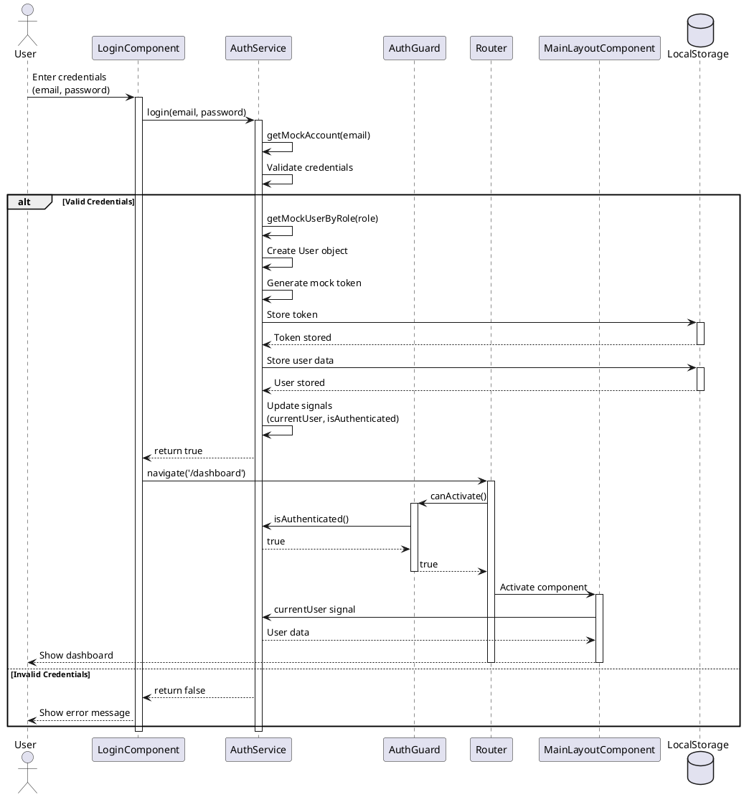
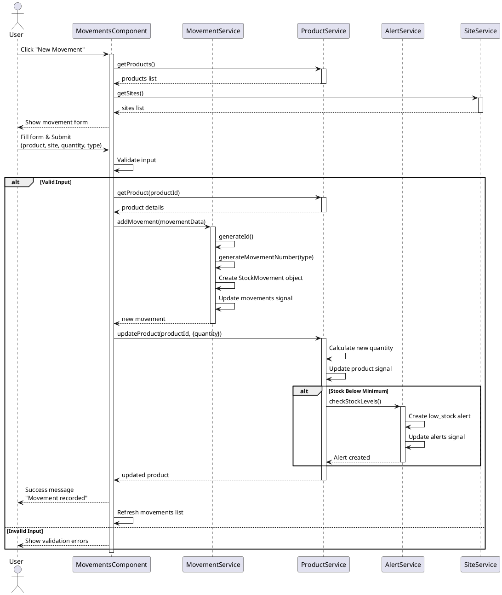
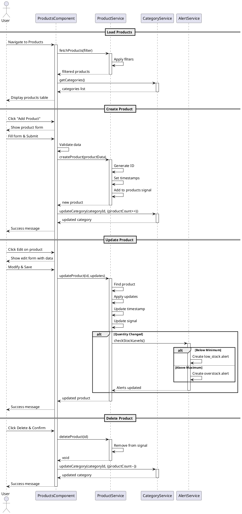
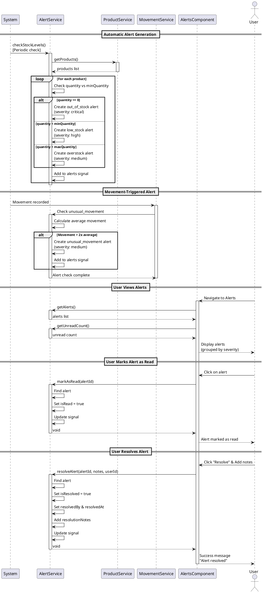

# UML Diagrams - Inventory Management System (PFE)

This document contains the UML diagrams for the inventory management system, including class diagrams and sequence diagrams.

## Table of Contents
1. [Class Diagrams](#class-diagrams)
   - [Domain Model (Models)](#domain-model)
   - [Services Architecture](#services-architecture)
   - [Components Structure](#components-structure)
2. [Sequence Diagrams](#sequence-diagrams)
   - [User Authentication](#user-authentication)
   - [Create Stock Movement](#create-stock-movement)
   - [Product Management](#product-management)
   - [Alert Processing](#alert-processing)

---

## Class Diagrams

### Domain Model

This diagram shows the core domain models and their relationships.



---

### Services Architecture

This diagram shows the service layer architecture and dependencies.

```plantuml
@startuml Services Architecture

package "Core Services" {
  
  class AuthService {
    - TOKEN_KEY: string
    - USER_KEY: string
    - currentUser: signal<User | null>
    - isAuthenticated: signal<boolean>
    --
    + login(email: string, password: string): Promise<boolean>
    + logout(): void
    + getUserRole(): UserRole | null
    + hasPermission(permission: Permission): boolean
    - loadUser(): User | null
    - hasToken(): boolean
  }

  class AuthorizationService {
    + canAccess(requiredPermission: Permission): boolean
    + canAccessRoute(route: string): boolean
    + getRolePermissions(role: UserRole): Permission[]
  }

  class ProductService {
    - products: signal<Product[]>
    --
    + getProducts(): signal<Product[]>
    + fetchProducts(filter?: ProductFilter): Promise<Product[]>
    + getProduct(id: string): Promise<Product | undefined>
    + createProduct(product: Omit<Product, ...>): Promise<Product>
    + updateProduct(id: string, updates: Partial<Product>): Promise<Product>
    + deleteProduct(id: string): Promise<void>
    - delay(ms: number): Promise<void>
  }

  class MovementService {
    - movementsSignal: signal<StockMovement[]>
    --
    + getMovements(): signal<StockMovement[]>
    + getFilteredMovements(filter: MovementFilter): computed<StockMovement[]>
    + getMovementById(id: string): StockMovement | undefined
    + addMovement(movement: Omit<StockMovement, ...>): StockMovement
    + updateMovement(id: string, updates: Partial<StockMovement>): StockMovement
    + deleteMovement(id: string): void
    + getSummary(): MovementSummary
    - generateId(): string
    - generateMovementNumber(type: string): string
  }

  class SiteService {
    - sites: signal<Site[]>
    --
    + getSites(): signal<Site[]>
    + getActiveSites(): computed<Site[]>
    + getSite(id: string): Site | undefined
    + createSite(site: Omit<Site, ...>): Site
    + updateSite(id: string, updates: Partial<Site>): Site
    + deleteSite(id: string): void
  }

  class CategoryService {
    - categories: signal<Category[]>
    --
    + getCategories(): signal<Category[]>
    + getCategory(id: string): Category | undefined
    + createCategory(category: Omit<Category, ...>): Category
    + updateCategory(id: string, updates: Partial<Category>): Category
    + deleteCategory(id: string): void
  }

  class AlertService {
    - alerts: signal<Alert[]>
    --
    + getAlerts(): signal<Alert[]>
    + getUnreadAlerts(): computed<Alert[]>
    + getUnreadCount(): computed<number>
    + getAlertsBySeverity(severity: AlertSeverity): Alert[]
    + markAsRead(alertId: string): void
    + markAllAsRead(): void
    + resolveAlert(alertId: string, notes: string, user: string): void
    + deleteAlert(alertId: string): void
    - checkStockLevels(): void
    - generateId(): string
  }
}

package "Guards" {
  class AuthGuard {
    - authService: AuthService
    --
    + canActivate(route: ActivatedRouteSnapshot): boolean
  }
}

' ===== Relationships =====
AuthGuard --> AuthService : uses
AuthorizationService --> AuthService : uses

ProductService ..> Product : manages
MovementService ..> StockMovement : manages
SiteService ..> Site : manages
CategoryService ..> Category : manages
AlertService ..> Alert : manages

MovementService --> ProductService : may update stock
AlertService --> ProductService : monitors
MovementService --> SiteService : references sites

@enduml
```



---

### Components Structure

This diagram shows the Angular components hierarchy and their relationships.

```plantuml
@startuml Components Architecture

package "App Root" {
  class AppComponent {
    - title: string
  }
}

package "Layouts" {
  class MainLayoutComponent {
    - currentUser: signal<User | null>
    - isAuthenticated: signal<boolean>
    - menuOpen: boolean
    --
    + logout(): void
    + toggleMenu(): void
  }
}

package "Features" {
  
  package "Auth" {
    class LoginComponent {
      - authService: AuthService
      - router: Router
      - email: string
      - password: string
      - errorMessage: string
      --
      + login(): Promise<void>
    }
  }

  class DashboardComponent {
    - productService: ProductService
    - movementService: MovementService
    - alertService: AlertService
    - siteService: SiteService
    - stats: DashboardStats
    --
    + ngOnInit(): void
    - loadDashboardData(): void
  }

  class ProductsComponent {
    - productService: ProductService
    - categoryService: CategoryService
    - products: signal<Product[]>
    - selectedProduct?: Product
    - filter: ProductFilter
    --
    + ngOnInit(): void
    + loadProducts(): void
    + createProduct(product: Product): void
    + updateProduct(id: string, product: Product): void
    + deleteProduct(id: string): void
    + applyFilter(): void
  }

  class MovementsComponent {
    - movementService: MovementService
    - productService: ProductService
    - siteService: SiteService
    - movements: signal<StockMovement[]>
    - filter: MovementFilter
    --
    + ngOnInit(): void
    + loadMovements(): void
    + createMovement(movement: StockMovement): void
    + applyFilter(): void
  }

  class AlertsComponent {
    - alertService: AlertService
    - alerts: signal<Alert[]>
    - filter: AlertFilter
    --
    + ngOnInit(): void
    + loadAlerts(): void
    + markAsRead(id: string): void
    + resolveAlert(id: string, notes: string): void
    + deleteAlert(id: string): void
  }

  class SitesComponent {
    - siteService: SiteService
    - sites: signal<Site[]>
    - selectedSite?: Site
    --
    + ngOnInit(): void
    + loadSites(): void
    + createSite(site: Site): void
    + updateSite(id: string, site: Site): void
    + deleteSite(id: string): void
  }

  class MembersComponent {
    - authService: AuthService
    - users: User[]
    --
    + ngOnInit(): void
    + loadMembers(): void
  }

  class ProfileComponent {
    - authService: AuthService
    - currentUser: signal<User | null>
    --
    + ngOnInit(): void
    + updateProfile(updates: Partial<User>): void
  }

  class ScannerComponent {
    - productService: ProductService
    - scannedBarcode: string
    --
    + onScan(barcode: string): void
    + lookupProduct(barcode: string): void
  }

  class UserManagementComponent {
    - authService: AuthService
    - users: User[]
    --
    + ngOnInit(): void
    + createUser(user: User): void
    + updateUser(id: string, user: User): void
    + deleteUser(id: string): void
  }
}

package "Shared Components" {
  class RoleBadgeComponent {
    - role: UserRole
    - size: 'small' | 'medium' | 'large'
  }

  class TestCredentialsComponent {
    - mockAccounts: MockAccount[]
    - visible: boolean
    --
    + copyCredentials(account: MockAccount): void
  }
}

' ===== Relationships =====
AppComponent --> MainLayoutComponent : contains
MainLayoutComponent --> DashboardComponent : routes to
MainLayoutComponent --> ProductsComponent : routes to
MainLayoutComponent --> MovementsComponent : routes to
MainLayoutComponent --> AlertsComponent : routes to
MainLayoutComponent --> SitesComponent : routes to
MainLayoutComponent --> MembersComponent : routes to
MainLayoutComponent --> ProfileComponent : routes to
MainLayoutComponent --> ScannerComponent : routes to
MainLayoutComponent --> UserManagementComponent : routes to

LoginComponent --> AuthService : uses
DashboardComponent --> ProductService : uses
DashboardComponent --> MovementService : uses
DashboardComponent --> AlertService : uses
DashboardComponent --> SiteService : uses
ProductsComponent --> ProductService : uses
ProductsComponent --> CategoryService : uses
MovementsComponent --> MovementService : uses
MovementsComponent --> ProductService : uses
MovementsComponent --> SiteService : uses
AlertsComponent --> AlertService : uses
SitesComponent --> SiteService : uses
MembersComponent --> AuthService : uses
ProfileComponent --> AuthService : uses
ScannerComponent --> ProductService : uses
UserManagementComponent --> AuthService : uses

MainLayoutComponent ..> RoleBadgeComponent : uses
LoginComponent ..> TestCredentialsComponent : uses

@enduml
```



---

## Sequence Diagrams

### User Authentication

This sequence diagram shows the authentication flow from login to accessing protected resources.



---

### Create Stock Movement

This sequence diagram illustrates the process of creating a stock movement (entry or exit).



---

### Product Management

This sequence diagram shows the complete lifecycle of product management operations.



---

### Alert Processing

This sequence diagram demonstrates how alerts are generated, monitored, and resolved.



---

## How to View These Diagrams

### Option 1: Online PlantUML Viewer
1. Copy the PlantUML code for any diagram
2. Visit [PlantUML Online Editor](http://www.plantuml.com/plantuml/uml/)
3. Paste the code and view the rendered diagram

### Option 2: VS Code Extension
1. Install "PlantUML" extension in VS Code
2. Install Java (required for PlantUML)
3. Open this file and use `Alt+D` to preview diagrams

### Option 3: Generate PNG/SVG Images
Use PlantUML CLI or online tools to generate image files:
```bash
# If you have PlantUML installed
plantuml UML_DIAGRAMS.md
```

---

## Diagram Descriptions

### Class Diagrams

1. **Domain Model**: Shows all core domain entities (User, Product, StockMovement, Site, Alert, Category) with their attributes and relationships. This represents the data model of the application.

2. **Services Architecture**: Illustrates the service layer with all business logic services (AuthService, ProductService, MovementService, etc.) and their dependencies.

3. **Components Structure**: Displays the Angular components hierarchy, showing how different UI components interact with services.

### Sequence Diagrams

1. **User Authentication**: Complete authentication flow from login form submission to accessing protected routes.

2. **Create Stock Movement**: Shows the process of recording a stock entry/exit, including product updates and alert generation.

3. **Product Management**: Demonstrates CRUD operations for products with category updates and alert triggers.

4. **Alert Processing**: Illustrates automatic alert generation, user notification, and alert resolution workflow.

---

## Notes

- All diagrams use PlantUML syntax for easy version control and text-based editing
- The diagrams reflect the current implementation as of the project state
- Services use Angular signals for reactive state management
- Authentication is currently using mock accounts stored in the models
- The system supports three user roles: admin, gestionnaire_de_stock, and operateur
- All timestamps use JavaScript Date objects
- IDs are generated using various strategies (timestamps, random strings)

---

**Last Updated**: February 1, 2026  
**Project**: PFE - Inventory Management System  
**Author**: UML Documentation
